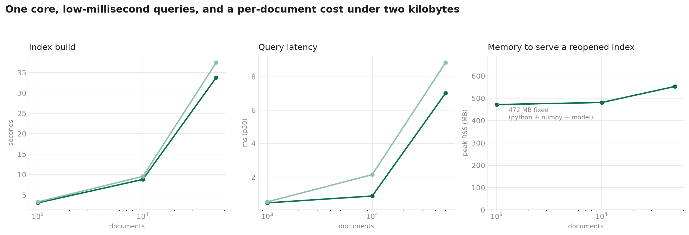
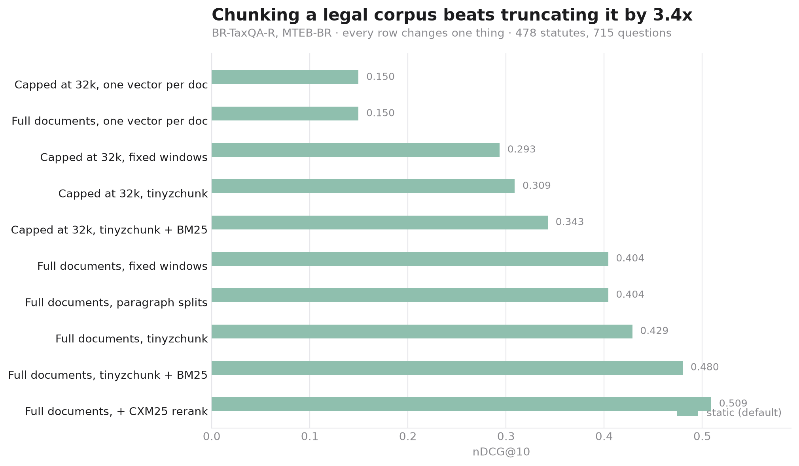
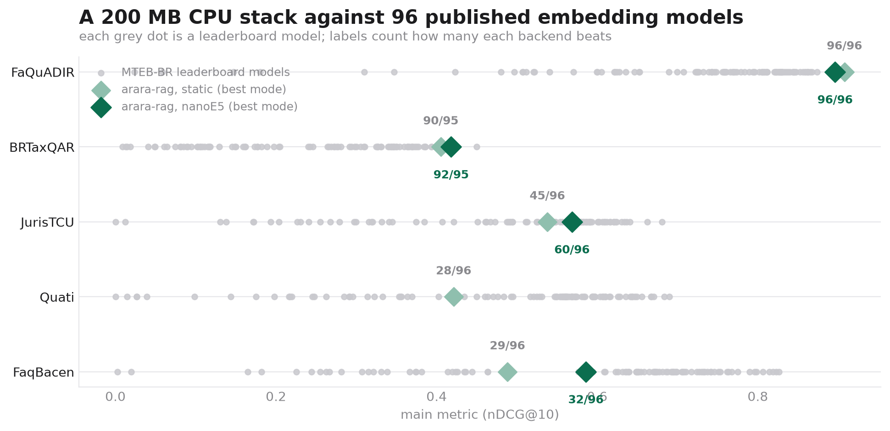

# arara-rag

**Portuguese-first retrieval that runs entirely on CPU.** Chunking, dense and
lexical retrieval, rank fusion and reranking — numpy only. No PyTorch, no ONNX
Runtime, no FAISS. The whole install is **200 MB**.

```bash
pip install arara-rag
```

```python
from arara_rag import Arara

arara = Arara(path="./indice")            # out-of-core and persistent
arara.add_documents(
    {"lei_1234": open("lei.txt").read()},
    metadata={"ano": 2024, "tipo": "lei", "uf": "BR"},
)
hits = arara.search("qual a alíquota?", top_k=5, where={"ano": {"$gte": 2020}})
print(hits[0].doc_id, arara.resolve(hits[0]))     # exact source span
```

## What's in it

| Stage | Component | Size |
|---|---|---|
| Chunking | [`tinyzchunk`](https://github.com/cnmoro/tinyzchunk) — tokenizer-free, distilled from an LLM teacher | 2.1 MB |
| Dense | [`static-nomic-384-pten-v2`](https://huggingface.co/cnmoro/static-nomic-384-pten-v2) — Model2Vec static embeddings | 62 MB |
| Lexical | BM25 over a numpy inverted index | — |
| Rerank | [`CXM25`](https://github.com/cnmoro/CXM25) — PT-BR lexical scoring | bundled |
| Fusion | Reciprocal Rank Fusion | — |

An index can be **out-of-core**: vectors live in a memory-mapped file and
documents, metadata and offsets in SQLite, so the index is about **1 KB per
document** and cold pages can be evicted by the OS instead of being pinned on
the heap. Same API either way — `Arara()` keeps everything in memory.

## Speed and memory

One CPU core, no GPU. Measured end to end with `python -m bench.profile`.

| documents | index build | query p50 | query p95 | index size | peak RSS to serve |
|---|---|---|---|---|---|
| 1,000 | 3.1 s | **0.45 ms** | 0.54 ms | 1.8 MB | 472 MB |
| 10,000 | 8.8 s | **0.86 ms** | 6.8 ms | 18 MB | 481 MB |
| 50,000 | 33.8 s | **7.0 ms** | 8.0 ms | 91 MB | 553 MB |

- **~1,300–1,500 documents/second** to chunk, embed, tokenise and index —
  chunking and embedding are per-document, so they run across processes.
  A single process manages ~300/second.
- **~1.8 KB per document** of index: 1.5 KB of vectors plus BM25 postings.
- Query latency scales with corpus size because both retrievers score the whole
  corpus per query — that is what makes the ranking exact rather than
  approximate.
- Peak RSS is dominated by a **~470 MB fixed cost** (Python, numpy, the
  embedding model and the tokenizer tables); the corpus adds ~1.7 KB per
  document on top. Vectors are memory-mapped, so cold pages can be evicted.



## Retrieval quality

MTEB-BR, the Brazilian Portuguese benchmark with a
[public leaderboard](https://huggingface.co/spaces/MTEB-BR/leaderboard).
nDCG@10, fixed-window chunking. Metrics are computed by `bench/metrics.py`,
which `bench/validate_metrics.py` checks against `pytrec_eval` to **0.0e+00**.

| Task | docs | dense | lexical | hybrid |
|---|---|---|---|---|
| BRTaxQAR (capped) | 478 | 0.2934 | **0.4051** | 0.3486 |
| FaQuADIR | 244 | 0.7139 | **0.8961** | 0.8304 |
| FaqBacenRetrieval | 1,673 | 0.3745 | **0.4881** | 0.4526 |
| JurisTCU | 16,045 | 0.3887 | **0.5378** | 0.4890 |
| Quati | 50,000 | 0.3268 | **0.4067** | 0.4046 |

CXM25 reranking on top of the hybrid adds **+0.018 to +0.077 nDCG@10** across
these tasks for 1–6 ms per query (FaQuADIR: 0.8304 → **0.9078**,
BRTaxQAR full documents: 0.4801 → **0.5091**).

## Why chunking matters most

Legal documents in BR-TaxQA-R average 32,000 characters and reach 1.17M. MTEB-BR
truncates them at 32k because transformer encoders cannot fit more. arara
chunks, so it indexes the whole statute.

| Configuration | chunks | nDCG@10 | R@100 |
|---|---|---|---|
| capped at 32k, one vector per doc *(the leaderboard's setting)* | 478 | 0.1496 | 0.4351 |
| capped at 32k, fixed windows | 2,552 | 0.2934 | 0.6300 |
| capped at 32k, **tinyzchunk** | 23,319 | 0.3088 | 0.6225 |
| **full documents**, fixed windows | 6,439 | 0.4041 | 0.7497 |
| **full documents**, paragraph splits | 6,439 | 0.4041 | 0.7497 |
| **full documents**, tinyzchunk | 60,927 | 0.4287 | 0.7486 |
| **full documents**, tinyzchunk + BM25 | 60,927 | 0.4801 | 0.8496 |
| **full documents**, + CXM25 rerank | 60,927 | **0.5091** | 0.8102 |



## Against the leaderboard

**On FaQuADIR, arara's best configuration outranks all 96 models on the board**
— above `voyage-context-4`, `gemini-embedding-2` and `Qwen3-Embedding-8B` — on
one CPU core. On BR-TaxQA-R it beats 90 of 95.

The honest caveat: the leaderboard evaluates *embedding* models, and there is no
BM25 entry on it. arara's strongest modes are lexical, and lexical retrieval is
simply very good on short, high-overlap PT-BR documents — part of that gap is a
missing baseline on their side, not a transformer-killing dense model on ours.



## Reranking

MTEB-BR reranking hands you a fixed candidate list and scores only the order
(MAP@1000), so `identity` is the baseline the benchmark ships with.

| Task | identity | dense | lexical | hybrid | **CXM25** |
|---|---|---|---|---|---|
| QuatiReranking | 0.2839 | 0.2798 | 0.2939 | 0.3066 | **0.3100** |
| JurisTCUReranking | 0.4150 | 0.3609 | 0.4279 | 0.4129 | **0.4845** |

## Out-of-core, metadata, CRUD

An index is read far more than it is written, so deletes are tombstones and
freed slots are recycled on the next write.

```python
arara = Arara(path="./indice", max_chunk_chars=2000)

arara.add_documents(docs, metadata={"ano": 2024})        # insert / replace
arara.update_metadata("lei_1234", {"revisado": True})    # no re-embedding
arara.delete_document("lei_1234")                        # tombstone + slot reuse
arara.get_document("lei_1234")                           # (text, metadata)
arara.compact()                                          # reclaim file space

arara.search(q, where={"tipo": {"$in": ["lei", "decreto"]}, "ano": {"$gte": 2020}})
arara.search(q, where={"$or": [{"uf": "SP"}, {"uf": "RJ"}]})
```

Supported per field: `$eq` (bare value), `$ne`, `$gt`, `$gte`, `$lt`, `$lte`,
`$in`, `$nin`, `$exists`, `$contains`, `$startswith`, `$endswith`; plus
top-level `$and` / `$or`. Field names are validated and values are bound as SQL
parameters, so a filter cannot inject SQL.

## Guarantees

Enforced by 88 tests, not asserted in prose:

- every chunk is an **exact substring** of the canonical document, ordered and
  non-overlapping, with only whitespace between chunks — nothing is dropped;
- **no chunk exceeds `max_chunk_chars`**, including on a 24,000-character line;
- CRLF and LF inputs chunk **identically** and offsets still resolve;
- the in-memory and on-disk paths return **identical rankings**;
- importing the package never imports `torch` or `onnxruntime`.

## Reproduce

```bash
python -m venv .venv && .venv/bin/pip install -e ".[bench,validate,dev]"
python -m pytest tests/                 # 88 tests
python bench/validate_metrics.py        # metrics vs pytrec_eval
./bench/run_all.sh                      # every suite -> bench/results/
python -m bench.profile                 # speed and memory -> docs/scaling.png
python -m bench.charts                  # regenerate the figures
python -m bench.leaderboard             # compare against MTEB-BR
```

## Layout

```
arara_rag/
  chunk.py      chunking and the losslessness contract
  dense.py      static encoder
  lexical.py    BM25 inverted index + CXM25 reranker
  store.py      memory-mapped vectors, SQLite catalog, filters
  pipeline.py   Arara: add / search / rerank / CRUD
bench/          task loaders, metrics, suites, profiling, charts
tests/          88 contract and correctness tests
space/          Gradio demo
```

## Limitations

- **PT-BR and English.** The tokenizer, stemmer and stopwords are Portuguese.
- **The dense model is small** and static; lexical retrieval carries the stack
  on short, high-overlap documents.
- **Per-chunk bookkeeping stays resident** (16 bytes/chunk); vectors, text and
  metadata do not.
- **CXM25 reranking is ~71 µs/document**, so it runs over a candidate set.
- **Index build forks worker processes** to parallelise chunking and embedding.
  Set `workers=1` where forking is unsafe or unavailable; the result is
  byte-identical, only slower.

## License

Apache-2.0.
